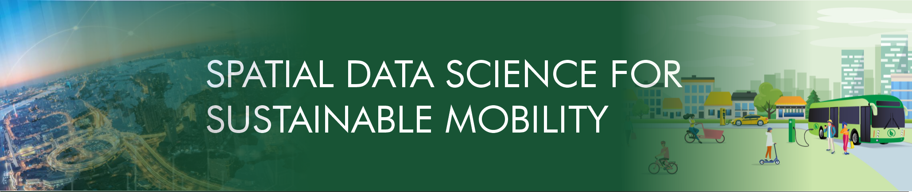

Mobility data and network analysis tools for understanding sustainable mobility
===============================================================================

The aim of the workshop is to introduce quantitative approaches to analyse sustainable mobility and accessibility using mobile phone data and network analysis tools. The workshop aims to improve participants’ skills in analysing travel-related carbon emissions using open-source Python libraries. In the workshop, we will use various geospatial data sources from the Helsinki Metropolitan area, including app-based mobile phone data, street networks, GTFS public transport schedules, and carbon emission data. The participants can compare how spatial accessibility and travel-related carbon emissions differ by different transport modes. Furthermore, the participants can link socio-ecological accessibility metrics to population data, making it possible to explore socio-environmental inequalities in urban space. We discuss the benefits and shortcomings of various types of mobility/population/accessibility data for studying sustainable mobility. The workshop ends with a discussion on the role of publicly available spatial data and tools for planning equitable and sustainable cities and mobility systems.

Open scientific software and collaboration by coding have become important drivers for advancing Geospatial Data Science, and science in general. Open scientific tools and sharing analytical workflows with computational notebooks promote openness, collaboration, transparency and reproducibility, by making it easy for others to access and run the same analyses. This is essential not only for validating research results, but also for allowing scientists to build upon each other's work more efficiently, which can lead to faster progress and breakthroughs in a wide range of fields.

The open science and data-driven approaches have become integral part of research that investigates issues related to spatial accessibility and mobility. Computational approaches are important for understanding i) how well the current transport system promotes equitable and sustainable accessibility and mobility within planetary limits, as well as ii) being able to vision possible mobility and accessibility futures based on computational tools that allow generating future scenarios under given constraints and changes applied to the system. Ensuring equitable accessibility and mobility justice is critical to develop effective and widely acceptable net-zero policies, and therefore fundamental to bring about long lasting changes and prevent conflict.

This workshop aims at bringing to the forefront open scientific software, data-driven tools as well as other methodological advancements that support understanding and modelling accessibility and/or mobility and their linkages to social-environmental sustainability in urban or rural settings. Given the interdisciplinary nature of this topic, the workshop welcomes contributions by researchers coming from a wide range of backgrounds in a format that involves both short presentations and demo sessions.

------------

Program
=======

The workshop will take place in Kavastu outside of Tartu.

**Tuesday 11.6 - 14:00-16:00**

- Welcome and introduction to the Sustainable Mobility modelling
- Tutorials for carbon emission computations using Python

**Wednesday 12.6 - 9:30-15:00**

- Working time with data and Python tools

**Thursday 13.6 - 14:40-15:15**

- PhD Workshop presentations

**Friday 14.6 - 9:00-10:00**

- PhD School Reflections

Organization
============

- Henrikki Tenkanen, Aalto University, FI
- Subhrasankha Dey, Aalto University, FI 

Contact
=======

Please contact Henrikki Tenkanen at henrikki.tenkanen@aalto.fi with any workshop related questions.

.. |br| raw:: html

      <be>

Contents
------------

.. toctree::
   :maxdepth: 1
   :caption: Information

   info/installing-miniconda
   info/License-terms

.. toctree::
   :maxdepth: 1
   :caption: Presentations

   presentations/welcome_to_workshop
   presentations/intro_to_tutorial_and_accessibility
   presentations/r5py_and_r5r_tools

.. toctree::
   :maxdepth: 1
   :caption: Tutorials

   notebooks/Intro-to-data.ipynb
   notebooks/T1_spatial_network_analysis_SingleOD.ipynb
   notebooks/T2_calculating-travel-time-matrices_and_GHG_factors.ipynb

.. toctree::
   :maxdepth: 1
   :caption: Workshop assignment

   presentations/Workshop_Assignment.rst

